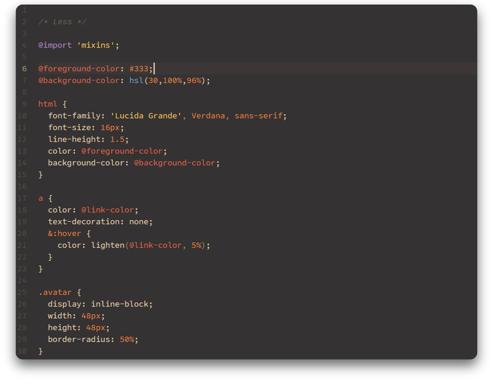

# Examples

> The font used in the screenshots above is [Office Code Pro](https://github.com/nathco/Office-Code-Pro).

# Install

From the command line:

`apm install rocket-dark-syntax`

If the command line isn't your thing:

- Go to **Settings > Install**
- Search for `rocket dark syntax` and click **Install**
- Go to **Settings > Themes** and choose **Rocket Dark** from the dropdown menu
- Happy coding! ♥
